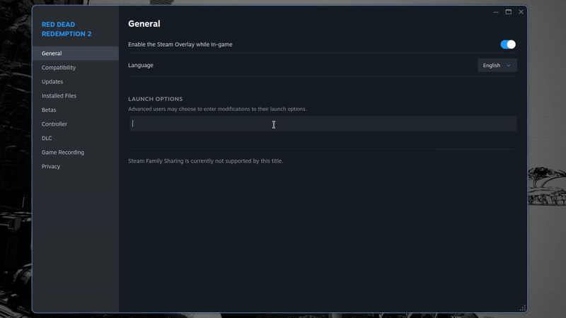

# BananaScope

> [!Note]
> This script is designed to be binded to a key within your window manager.

Launch games with BananaScope, software that uses Gamescope to run games at various resolutions and HDR settings via rofi/dmenu interface. 
Supports [MangoHud](https://github.com/flightlessmango/MangoHud) and ultrawide (21:9) resolutions.

## Resolution list
* 7680x4320 (8k (unstable/not suggested))
* 5120×2160 (4k Ultrawide)
* 3840x2160 (4k HDR)
* 3840x2160 (4k)
* 3440x1440 (UltraWide 1440p)
* 2560x1440 (1440p HDR)
* 2560x1440 (1440p)
* 2160x1080 (Ultrawide 1080p)
* 1920x1080 (1080p)
* 1280x720p (720p)

> [!WARNING]  
> HDR is an untested work in progress, so it may not work as intended on your device. Please refer to the Gamescope section of the [Arch Linux wiki](https://wiki.archlinux.org/title/Gamescope) for more info.

## Dependencies
* [dmenu](https://tools.suckless.org/dmenu/)/[rofi](https://github.com/davatorium/rofi)
* [gamescope](https://github.com/ValveSoftware/gamescope)
* [ydotool](https://github.com/ReimuNotMoe/ydotool)

 ## In-progess features:
 * options menu:
   * Mangohud toggle
   * HDR customisation
   * other general launch options
